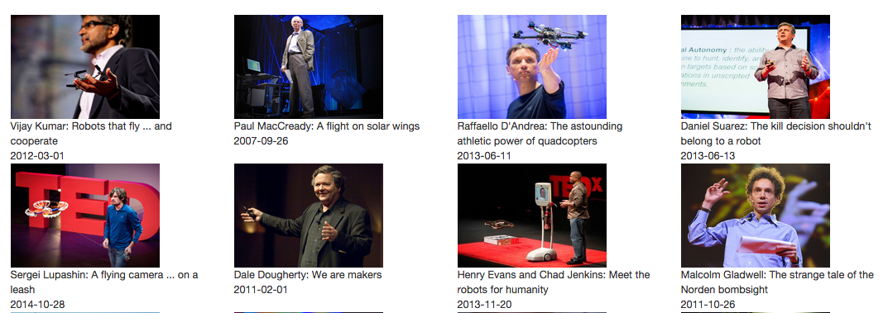

# Word Fit
Learn more about the developer: www.linkedin.com/in/katherinehuwu/

Want to learn more vocabulary but have no idea where to start? Word Fit can help you select the most important vocabulary and offer a personalized learning experience! 

Word Fit empowers English language learners at the intermediate to advanced level to expand their vocabulary repertoire. For any given Ted talk, Word Fit parses through the entire transcript to create a prioritized list of vocabulary. Each vocabulary is selected based on its academic level, usage frequency, and word complexity and accompanied with learning resources from Merriam Webster’s Dictionary and New York Times. It also generates vocabulary exercises and a personalized vocabulary list with data visualization to help users track their learning progress.
 
####**Technology**
 
*Tech Stack* 

Python, Flask, SQLite, SQLAlchemy, NLTK, Regx, tempfile, Splitta, Beautiful Soup, Javascript, jQuery, AJAX/JSON, XML, Ted Talk API, Merriam Webster API, New York Times API, chart.js, Jinja, HTML, CSS, Bootstrap, Unit Test
 
 

*Vocabulary Parsing: Data Structures and Algorithms*   

A vocabulary parsing algorithm is developed to prioritize the 10 most academically relevant and frequent vocabulary from any selected ted talk. The ted talk transcript is retrieved using the ted talk API and Beautiful Soup for web scraping.  To create a prioritized list of vocabulary, every single word in the transcript is weighed on three criteria:
 
 - Academic Word:  A list of lemmatized academic words are obtained and converted into dictionary. A search in the dictionary determines whether the vocabulary is an academic word and returns boolean value.
 
 - Conceptual Complexity/ Word Length: According to studies on English complexities norm and cross-linguistic analysis studies, the length of English words reflects their conceptual complexity, and is also used to prioritize vocabulary. This criteria returns an integer value.
 
 - Usage Frequency: A histogram is used keep track of usage frequency for each vocabulary, which returns an integer value as well.
 

Using a dictionary data structure with the three selection criteria as key and the vocabulary as value, the dictionary is  converted and sorted in descending order to return the top 10 most important  vocabulary from the transcript.
 
 
 

 
 
 

*Vocabulary Learning Resources: APIs and Libraries*

 - Dictionary Information: The Merriam Webster’s Dictionary (MWD) API is used to retrieve the definitions, pronunciation, and parts of speech for each vocabulary. Beautiful Soup is used to parse out needed information from the XML response of this  API.
  
 - Vocabulary Usage in Ted Talk: Splitta, a sentence boundary detection tool is used to identify the ted talk sentence in which each vocabulary occurred. Splitta works in the command line with actual files, so the Python tempfile library is used to create temporary files which convert the string into a dictionary of sentences. This package will need to be installed and can be used as follows:
 
 -
 - 		os.popen("python resources/splitta/sbd.py -m  resources/splitta/model_nb -t " + input_text.name +" -o " + output_text.name)
		os.remove(input_text.name)
 
 -  Vocabulary Usage in New York Times : The JSON formatted data from NY Times API, provides context on how the vocabulary is word is most recently used in a written sentence. Since the response from NY Times included html tags around the queried key word, Regx is used to parse out the this unnecessary HTML tag.
 
 
 
 
  
 
  

*Database: Data Modeling and SQL*  

Information for each user, ted talk, vocabulary, and individual user’s selected word are stored using SQLite for efficiency. Using object relational mapping, the fields for each table can easily be accessed as attributes of each object. This enables personalized user storage of vocabulary and associated ted talks. It also allows for faster page loading time as repetitive API calls are avoided as well as easy generation of vocabulary exercises.
 
 
 

 
 
 

 
 
 
*Front-End: AJAX and JS Libraries*  

- Search Results Page: The loading efficiency for the search results page is significantly improved by using AJAX calls. The search results requires only one API call but for each talk, a separate API call is needed to retrieve both the image the description. As the Ted Talk API allows only two calls per second, leading to long wait time, the images and description are the populated by AJAX calls.
 
 
 

 
 

 - Selected Talk Page: The video and transcript is retrieved via web scrapping, and the transcript is then processed to retrieve the 10 vocabulary. A much longer processing time is needed to obtain additional vocabulary information since an API call is being made first to the Merriam Webster API and then to the New York Times API with additional language processing needed at the backend. To reduce the loading time, ajax calls are being used to retrieve both NY Times and Merriam Webster API info.
  
 
 
 
 
 
 - User Vocab Data: The pie chart is created dynamically by retrieving user vocabulary data via AJAX every time the user returns to homepage. This allows the pie chart to accurately reflect the user’s database and increases the fun factor as the colors for each ted talk are randomly generated.
 
 
 

 
 
 

####**Version 2.0**

 - Loading Efficiency: Create new tables in the database to store the images and description of the ted talks from the search results. This allows the page to be populated immediately should a user enter the same search term as others. This feature was postponed since search terms are unlikely to repeat, but once the product scales, storing information from the searched term will definitely be helpful
 
 - User’s Learning Experience: Develop more personalized learning experience by allowing users to select any vocabulary to store in their personalized list. Allow users to take notes and store their own comments or related images as they study each vocabulary. More varied vocabulary resources and  exercises such as antonyms, synonyms, meaning-matching, image-matching, morphosyntactic charts can also be added.
 
 - Machine Learning: The current vocabulary parsing algorithm targets college level English language learners. By applying machine learning algorithms, different levels of target learners can also benefit from the app. In the long run, teachers of various target learner groups can be invited to select the proper vocabulary from each talk, a training set can be set up for the app to select vocabulary based on the needs of various student groups. 
 
 
**Structure**
 - server.py:            Core of the flask app, lists all routes
 - model.py:             All database queries made by the flask app
 - lemma.py:             A dictionary of lemmatized academic words.
 - vocab_parsing.py:    Find list of prioritized vocab and attributes
 - ted_api.py:           Connects to Ted Talks API data 
 - dictionary_api.py:     Connects to Merriam Webster’s Dictionary API 
 - nytimes_api.py:       Connects to New York Times Article Search API
 - tests.py: 		Unit tests for vocab_parsing.py
 
 
**Resources**
 - http://www.newacademicwordlist.org/
 - https://rpubs.com/mll/33927
 - https://github.com/hinstitute/splitta
 - http://www.dictionaryapi.com/products/api-learners-dictionary.htm
 - http://developer.nytimes.com/
 - http://developer.ted.com/

